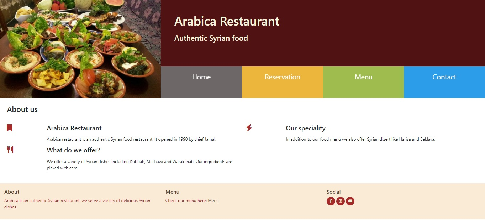

# Arabica Restaurant

[View the live link here](https://arabica-1982.herokuapp.com/)
 
This website is website of a restaurant that serves Syrian food. The main page has information about the restaurant. The navigation bar is connected to the reservation, menu and contact pages.
 

## Features
The website consist of a main page and several sub pages. On the main page, there is description of the restaurant. There are also clickable links to the reservation, menu and contact pages. The menu can be viewed in the menu page. Contact details are provided in the contact sub-page. Customers can also sign up, log in, make a reservation, edit reservation and cancel reservation.
## Technologies used
1. HTML
2. CSS
3. GIThub 
4. JavaScript
5. Python
6. free images from Google search.
7. paint 
8. bootstrap
9. Heroku
10. Elephantsql

## Testing 
Manual testing of all the features of the website was deploied and everything looks fuctioning such as the navigation bar and links. However, the reservation system is still not functioning properly. 
## Unfixed bugs 
The reservation system is not working due to insufficient time to finish the code.
The style for some parts of the website is not completed because of time ristriction.

## Deployment 
The site was deployed to Heroku website. 
## Credits
The design of the website was taken from the Bootstrap Resume at CodeInstitute.
Images were downloaded from Google.

## Acknowledgement
I would like to thank the Code Institute team for their contiuous support. 